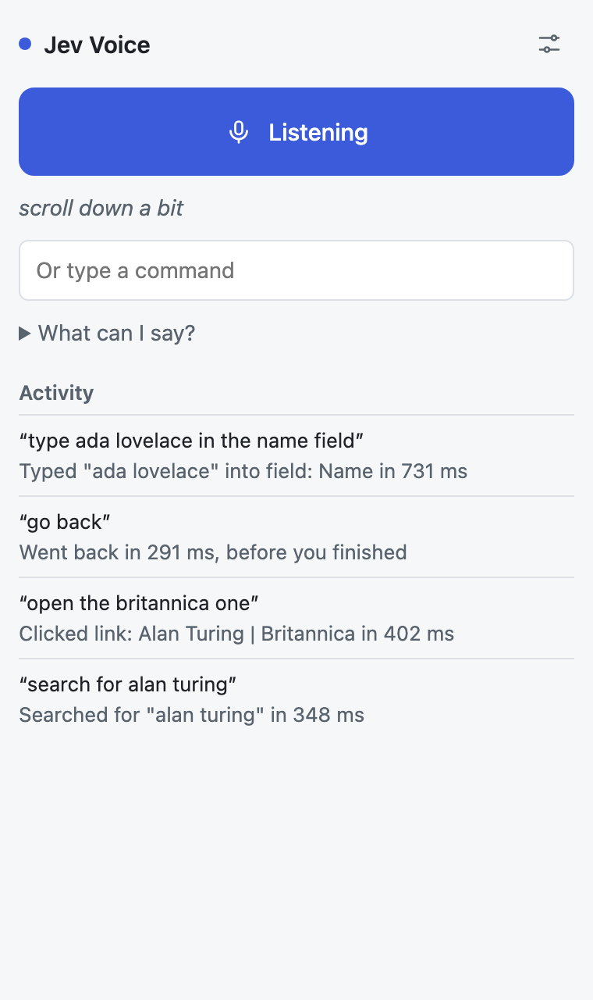
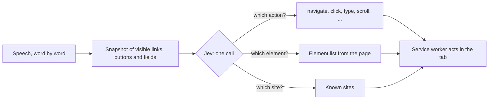

<div align="center">


# Jev Voice

**Control Chrome by voice.** Open sites, search, click links and fill in forms by saying what you want.

[](https://github.com/dgr8akki/jev-voice/actions/workflows/ci.yml)
[](LICENSE)


<picture>
  <source media="(prefers-color-scheme: dark)" srcset="docs/screenshot-dark.png" />
  
</picture>

</div>

## Features

- **Say it the way you'd say it.** "Open the Britannica one", "type hello in the email bar", "surname Pahuja".
- **Acts before you finish.** Commands such as "go back" or "scroll down" run as soon as they're unambiguous, often mid-sentence.
- **Fills in forms.** Picks the right field from its label, types the right words, and submits when you say "and press enter".
- **Takes corrections.** "No, that's the first name, not the surname" moves what it just typed.
- **Shows what it's doing.** A cursor glides to the element and outlines it before clicking or typing.
- **Private by default.** On-device speech recognition where Chrome supports it. No accounts, no analytics.

## How it works

Jev Voice is built on [Jev](https://typesafe.ai), TypeSafe's System One model. Jev doesn't generate text: it answers typed questions with probabilities. Jev Voice never asks it to write a URL, a CSS selector or the text to type. Code lists the candidates and Jev picks one.



- **Candidates, not generation.** Every visible link, button and field becomes a labelled option ("field: Email address"). Jev picks the one you meant.
- **Typing without generation.** For "type hello in this email bar", every run of consecutive words in the command is a candidate. A second, small Jev call picks "hello".
- **Early action.** On each new word, Jev also answers "is this command complete?". Commands that can't change with more words run immediately. Searches and typing always wait for you to finish.

## Install

Jev Voice isn't on the Chrome Web Store yet. To install from source:

1. Download the latest `jev-voice-x.y.z.zip` from [Releases](https://github.com/dgr8akki/jev-voice/releases) and unzip it, or clone this repo.
2. Open `chrome://extensions` and turn on **Developer mode**.
3. Click **Load unpacked** and select the unzipped folder (or `src/` in a clone).
4. Pin **Jev Voice** from the puzzle-piece menu.

You need an [AI Gateway API key](https://vercel.com/docs/ai-gateway/authentication-and-byok/api-keys) from Vercel. Jev costs $0.042 per million input tokens (a fraction of a cent per command). Set a [spend limit](https://vercel.com/docs/ai-gateway/observability-and-spend/budgets) on the key you use.

> [!NOTE]
> Use Google Chrome. Brave ships no working speech recognition; you can still type commands there.

## Usage

1. Click the Jev Voice icon to open the side panel.
2. Paste your API key in **Settings** and select **Save**. The panel checks the key.
3. Select **Start listening**. The first time, Chrome asks for microphone access in a new tab.

| Say                                                     | What happens                                    |
| ------------------------------------------------------- | ----------------------------------------------- |
| "Go to wikipedia", "open facebook dot com"              | Opens the site                                  |
| "Search for Alan Turing"                                | Searches Google                                 |
| "Click the first result", "open the pricing link"       | Clicks the matching link or button              |
| "Type hello in the email field and press enter"         | Types into the matching field, then submits     |
| "Surname Pahuja", "in first name put Akash"             | Types into the named field                      |
| "No, that's the first name, not the surname"            | Moves the text it just typed to the right field |
| "Scroll down", "go back", "go forward", "reload"        | Scrolls or navigates history                    |
| "New tab", "next tab", "previous tab", "close this tab" | Manages tabs                                    |

You can type any command in the box under the microphone button.

## Privacy and permissions

| Permission                | Why                                                                                |
| ------------------------- | ---------------------------------------------------------------------------------- |
| `sidePanel`               | Shows the controls beside the page                                                 |
| `scripting`, `<all_urls>` | Lists the visible links, buttons and fields on the active tab, and clicks or types |
| `storage`                 | Keeps your API key in this browser                                                 |
| Microphone                | Hears commands; audio is transcribed by the browser and never stored               |

For each command, the transcript, the active tab's URL and title, and the labels of visible links, buttons and fields are sent to Vercel AI Gateway, which forwards them to TypeSafe to run Jev. Field values and page text are not sent. See [PRIVACY.md](PRIVACY.md).

## Development

Requires Node.js 22 or later.

```sh
npm install
npm run check      # lint + format check + unit tests
npm run eval       # live evaluation against Jev (needs AI_GATEWAY_API_KEY in .env)
npm run package    # builds dist/jev-voice-<version>.zip for the Chrome Web Store
```

| Script            | Purpose                                                     |
| ----------------- | ----------------------------------------------------------- |
| `npm test`        | Unit tests with `node:test`; Jev and Chrome are faked       |
| `npm run lint`    | ESLint                                                      |
| `npm run format`  | Prettier                                                    |
| `npm run eval`    | Real Jev calls on 23 spoken commands; waits out rate limits |
| `npm run icons`   | Renders `assets/icon.svg` to PNGs with headless Chrome      |
| `npm run package` | Zips `src/` for upload and checks the version numbers match |

### Project structure

```
src/
├── manifest.json
├── background.js          Service worker: Chrome adapter and message routing
├── sidepanel/             Side panel UI (HTML, CSS, controller)
├── permission/            One-time microphone permission page
└── lib/
    ├── commands.js        Vocabulary, Jev questions, rules for acting early, text candidates
    ├── handler.js         One transcript end to end: snapshot, ask Jev, act
    ├── jev.js             Jev client: retries, rate-limit pauses, clear errors
    ├── page.js            Functions injected into the tab (snapshot, click, type, cursor)
    ├── queue.js           One request in flight; newest partial wins
    └── speech.js          Word-by-word speech recognition, on-device first
test/                      Unit tests (a fake browser for the handler, jsdom for page functions)
evals/                     Live evaluation against Jev
```

### Tests

- **Unit tests** cover the command rules, the whole handler against a fake browser (every action, corrections, pages that can't be scripted, acting once per utterance), and the injected page functions in jsdom.
- **The live evaluation** runs 23 commands, including partial phrases that must wait, through the real handler and the real model. It isn't part of CI because it needs a key and TypeSafe rate-limits bursts.

## Troubleshooting

| Problem                                           | Fix                                                                                                      |
| ------------------------------------------------- | -------------------------------------------------------------------------------------------------------- |
| "Couldn't find that on the page"                  | Only elements visible on screen are considered. Scroll so the element is in view, then try again.        |
| "Speech recognition can't reach Google's servers" | You're in Brave or behind a VPN that blocks Google speech. Use Chrome, or type commands.                 |
| "Jev is busy. Try again in 30s."                  | TypeSafe is overloaded. Wait, then repeat the command.                                                   |
| "Your API key was rejected"                       | Check the key in Settings. New Vercel accounts need a card on file before AI Gateway serves requests.    |
| Nothing happens on some pages                     | Chrome doesn't let extensions script `chrome://` pages or the Web Store. Navigation commands still work. |

## Limitations

- Sees only elements in the viewport, up to 100, and not inside cross-origin iframes or closed shadow roots.
- The cursor is drawn on the page; extensions can't move the system pointer.
- Clicking is synthetic, so a few sites that require trusted user input will ignore it.

## License

[MIT](LICENSE) © 2026 Aakash Pahuja
