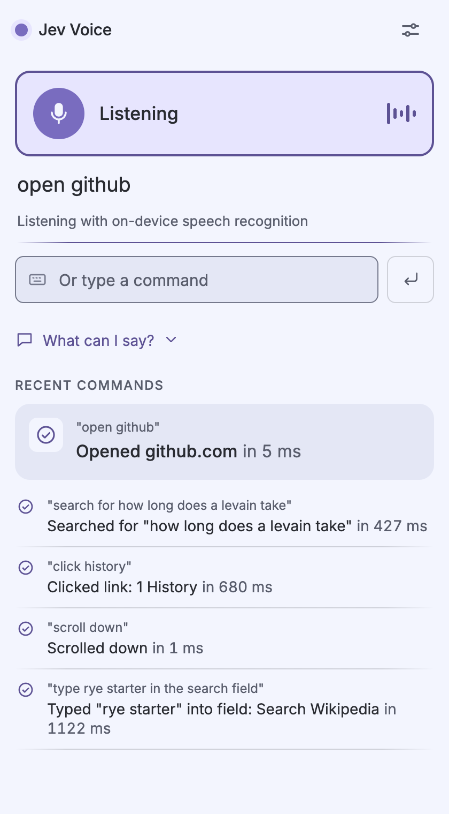
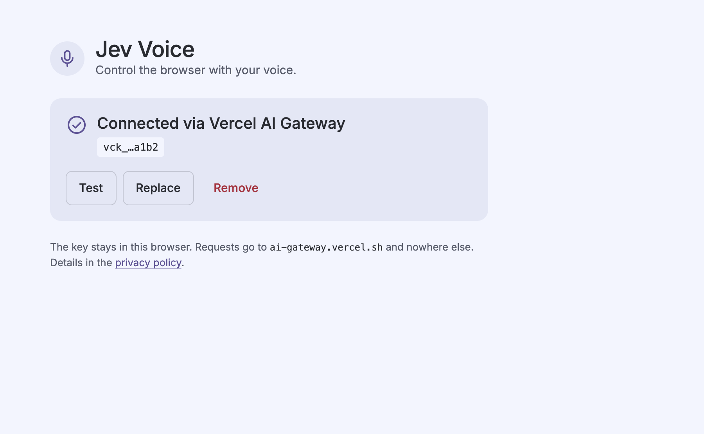

# Jev Voice

Jev Voice is a voice control extension for Chrome. You open sites, search, click links and fill in forms by saying what you want, and most short commands run before you have finished the sentence.

[](https://github.com/dgr8akki/jev-voice/actions/workflows/ci.yml)
[](LICENSE)

<picture>
  <source media="(prefers-color-scheme: dark)" srcset="docs/screenshot-dark.png" />
  
</picture>

## What it does

You don't have to learn a command list. "Open the Britannica one" and "surname Pahuja" both work, because the extension looks at what is on the page and works out which link or field you mean. Short commands like "go back" fire before you have finished saying the sentence; the side panel underlines the words it acted on. For forms, it picks the field from its label, types the words you said, and submits when you add "and press enter". If it put the text in the wrong field, "no, that's the first name" moves it.

Before it clicks or types, it draws a marker next to the element so you can see what it picked. Speech recognition runs on your machine on Chrome 139 and later, otherwise through Google's speech service, and the panel says which one is in use. There is no account, and requests go only to the provider you chose.

Scrolling, tabs, history and opening a site by name work as soon as the extension is installed. Clicking, typing and searching need a Jev key, which takes a couple of minutes to set up (see Install).

## How it works

Under the hood it calls Jev, TypeSafe's decision model, and treats it as a classifier rather than a generator. For each command the extension builds the lists itself: the actions it knows, the visible links, buttons and fields on the page (labels only, never their contents), a few well known sites, and every run of consecutive words in what you said. Jev picks one item from each list. It never writes a URL, a selector or the text to type, so a bad answer is at worst the wrong pick from a list the extension already had.

While you are still speaking, each partial transcript also carries the question "is this command complete?". Commands that cannot change with more words, like "scroll down", run as soon as Jev is confident. Searches and typing always wait for the final transcript.

## Install

The store listing is still in review, so for now it loads unpacked. Grab the newest `jev-voice-x.y.z.zip` from [Releases](https://github.com/dgr8akki/jev-voice/releases) and unzip it somewhere it can stay (Chrome reads the folder in place). At `chrome://extensions`, switch on Developer mode, choose Load unpacked, then select that folder (or `src/` in a clone). The microphone icon lands in the puzzle-piece menu; pin it so the side panel is one click away.

Clicking, typing and searching go through Jev, so they need a key of your own. Two kinds work: a [TypeSafe API key](https://console.typesafe.ai/keys), or a [Vercel AI Gateway key](https://vercel.com/docs/ai-gateway/authentication-and-byok/api-keys) that routes to the same model. Installing the extension opens its settings tab. Choose the provider whose key you have, paste it in and press Connect; Jev Voice makes one test request before storing the key, and from then on displays only a masked form of it.

Cost is small. TypeSafe's [pricing page](https://typesafe.ai/pricing) listed Jev at $0.042 per million input tokens in September 2026, which comes to a fraction of a cent per command. A Vercel key can also carry a [budget](https://vercel.com/docs/ai-gateway/observability-and-spend/budgets) that caps what it spends.

Brave has the speech API but no backend behind it, so use Chrome. Typed commands still work in Brave.

<picture>
  <source media="(prefers-color-scheme: dark)" srcset="docs/options-dark.png" />
  
</picture>

## Talking to it

Click the Jev Voice icon to open the side panel and press Start listening. The first time, Chrome asks for microphone access in a new tab. Then talk.

| Say                                                | What happens                                    |
| -------------------------------------------------- | ----------------------------------------------- |
| "Go to wikipedia", "open rte dot ie"               | Opens the site                                  |
| "Search for train times to Cork"                   | Searches Google                                 |
| "Click the first result", "open the pricing link"  | Clicks the matching link or button              |
| "Type hello in the email field and press enter"    | Types into the matching field, then submits     |
| "Surname Pahuja", "in first name put Akash"        | Types into the named field                      |
| "No, that's the first name"                        | Moves the text it just typed to the right field |
| "Scroll down", "go back", "go forward", "reload"   | Scrolls or navigates history                    |
| "New tab", "next tab", "previous tab", "close tab" | Manages tabs                                    |

You can type any command in the box under the microphone button.

## Access it asks for

| Permission                   | Why                                                                                                    |
| ---------------------------- | ------------------------------------------------------------------------------------------------------ |
| `sidePanel`                  | Shows the controls beside the page                                                                     |
| `scripting`, `http(s)://*/*` | Lists the visible links, buttons and fields on the active tab, and clicks, types or scrolls when asked |
| `storage`                    | Keeps your API key in this browser                                                                     |
| Microphone                   | Feeds Chrome's speech recogniser; Jev Voice keeps no audio                                             |

For each phrase, the transcript, the active tab's URL and title, and the labels of visible links, buttons and fields go to TypeSafe to run Jev, directly or through Vercel AI Gateway, whichever you picked. While you are speaking the same phrase may be sent several times. Field values and page text are never sent. The details are in [PRIVACY.md](PRIVACY.md).

## Development

Node.js 22 is the minimum. After `npm install`, `npm run check` is the gate: ESLint, a Prettier check and the unit tests, in that order. The spoken-command cases in `test/live/` hit the real model through `npm run live`. They read a key from `.env` (`TYPESAFE_API_KEY`, or `AI_GATEWAY_API_KEY` as the fallback) and stay out of CI, partly because TypeSafe rate-limits bursts and partly because every run is billed.

`npm run package` writes the store zip from `src/`. It stops with an error when `package.json` and the manifest carry different versions.

The unit tests fake both Chrome and Jev: the command rules, the whole handler against a fake browser, the injected page functions in jsdom, and the side panel and options page as real HTML in jsdom. Files listed in [SHARED.md](SHARED.md) are copies from a shared repo and are checked for drift in CI.

```
src/
├── manifest.json
├── _locales/              Store title and summary
├── background.js          The service worker: owns the tab, runs handler.js, answers the panel
├── sidepanel/             The panel itself: mic, transcript line, typed command, activity list
├── options/               Key setup; reveal.js is the Show/Hide button, the rest is shared
├── permission/            The tab that asks for the microphone, because a side panel cannot
├── ui/tokens.css          Colours, type and the button and status styles every page uses
├── fonts/                 Inter, bundled under the OFL so no page fetches a font
└── lib/
    ├── commands.js        What can be said: sites, actions, the questions for Jev, local commands
    ├── handler.js         Turns one transcript into one action, through the browser adapter
    ├── connection.js      The "Connected via" line and its button (shared)
    ├── jev.js             HTTP client for TypeSafe and Vercel (shared)
    ├── page.js            Everything injected into a web page: listing, marker, click, type
    ├── queue.js           Keeps one request in flight and drops stale partials
    └── speech.js          Wraps SpeechRecognition; on-device when Chrome has it
test/                      node:test suites with jsdom; test/live/ talks to the real model
```

## When something goes wrong

If it says it couldn't find something on the page, scroll so the element is on screen and say it again; only what is visible is considered, up to 100 elements. If it says Chrome doesn't let extensions see this page, you are on a `chrome://` page, the Web Store or a PDF, and only navigation and tab commands work there. "Can't reach api.typesafe.ai" means the request never left your network; check the connection or a VPN. "Your API key was rejected" means the provider refused the key: press Replace in settings and connect a new one. AI Gateway refuses requests from a Vercel account that has no payment card yet. When the panel reports that Google's speech servers are out of reach, the browser is Brave or a network rule is blocking Google speech; the typed-command box still works.

## Limitations

- It sees only elements in the viewport, up to 100, and not inside cross-origin iframes or closed shadow roots.
- The marker is drawn on the page; extensions can't move the system pointer.
- Clicking is synthetic, so a few sites that require trusted user input will ignore it.
- Element labels come from the page, so a page could name a link misleadingly to draw a click. Each label Jev sees carries the element's kind and position, which the page can't fake, and the activity list says exactly what was clicked, but the label text itself is the page's word.

## Related repos

The same Jev client also runs Slop Radar, Recipe Mode and Intent Guard. Each has its own repo under [github.com/dgr8akki](https://github.com/dgr8akki).

## License

[MIT](LICENSE) © 2026 Aakash Pahuja
